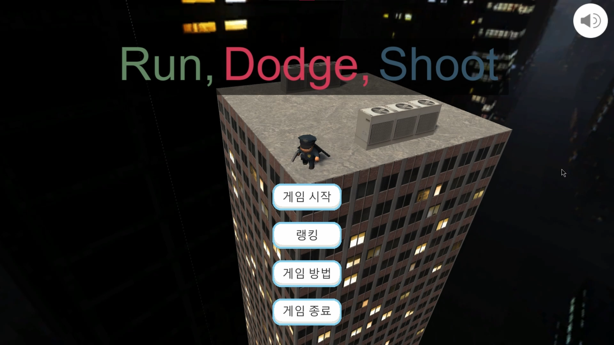
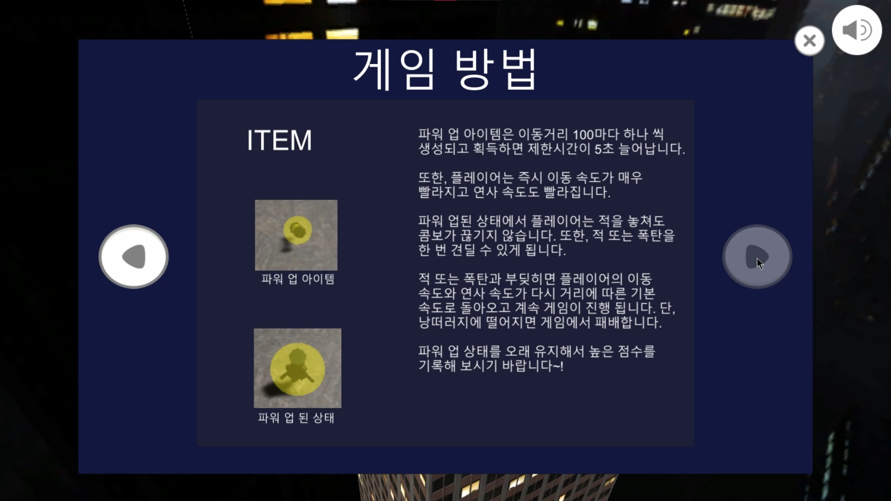
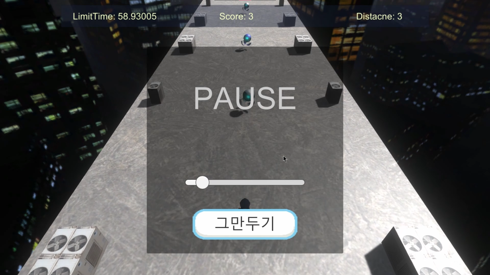
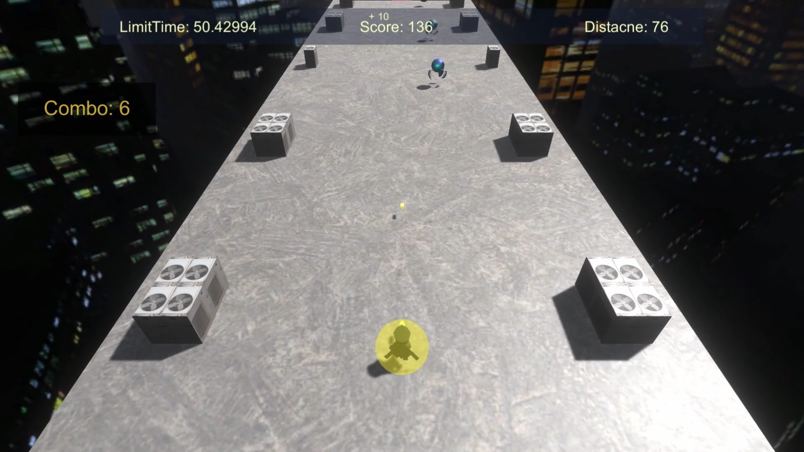
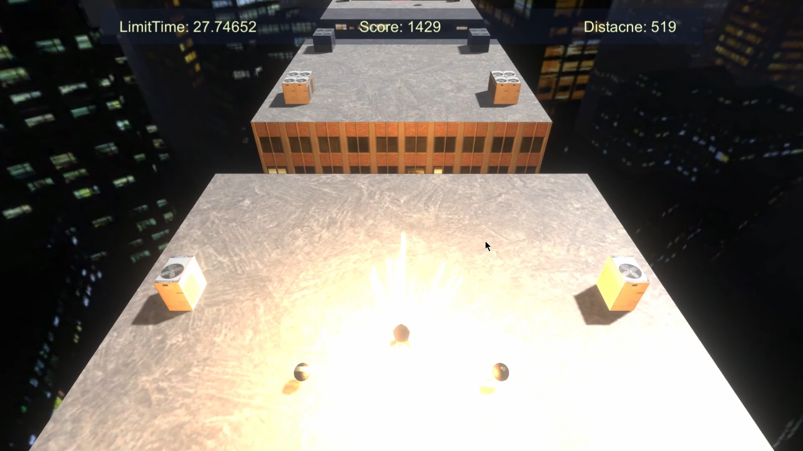
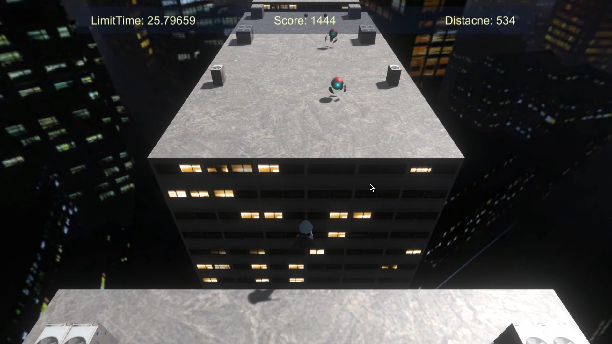
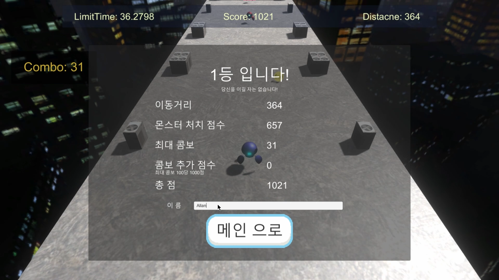
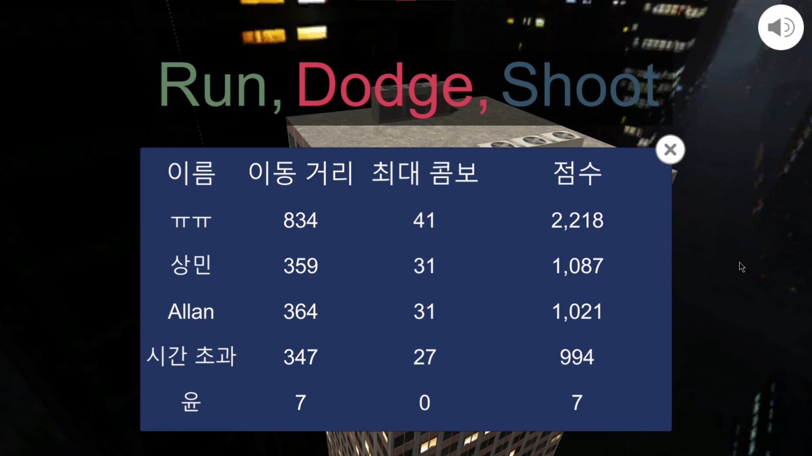

# Run, Dodge, Shoot

## 👉Summary

**[Game title :  Run, Dodge, Shoot]**  
**[Genre      :  Running Action Game]**  
**[Tools      :  Unity 3D]**  
**[Purpose    :  For experiencing level design]**  
**[Period     :  May.2021 - June.2021]**  
**[Head count :  1]**  

## 👉Implementations

*✔ Player Control: I made an enum that represents player's status and I implemented their behavior in the update function using switch statement.
    *Code Location: https://github.com/yoonsangmin/RunDodgeShoot/blob/main/Assets/Scripts/Player/PlayerControl.cs  

*✔ Level Control: I implemented level control class to parse text file and set level values.
    *Code Location: https://github.com/yoonsangmin/RunDodgeShoot/blob/main/Assets/Scripts/LevelControl/LevelControl.cs  
 
 
*✔ Stage Creator: I implemented stage creator that creates map and object contantly with level data.
 *Code Location: https://github.com/yoonsangmin/RunDodgeShoot/blob/main/Assets/Scripts/GameRoot/StageCreator.cs  
 
 
*✔ Sound Manager: Sound manager is a singleton class that ensures a class has only one instance and provides a global access point. It can load sound resources during running time and loaded resources can reuse.
    *Code Location: https://github.com/yoonsangmin/RunDodgeShoot/blob/main/Assets/Scripts/Sound/SoundManager.cs  

*✔ Object Pool: I implemented object pool to prevent allocation and freeing memory and reuse preallocated object instances. Bullets, blocks, enemies and etc. are created by class that inherit object pool.
    *Code Location: https://github.com/yoonsangmin/RunDodgeShoot/tree/main/Assets/Scripts/ObjectPooling  

*✔ Save Manager: Save manager can save and load ranking data and volume of sound using Json.
    *Code Location: https://github.com/yoonsangmin/RunDodgeShoot/blob/main/Assets/Scripts/Save/SaveManager.cs  

## 👉Game Screenshot

## 👉Game Video

- **유튜브 : [https://www.youtube.com/playlist?list=PLjSAhx-L2n8focZJGNkHP948APNj2nw7A](https://www.youtube.com/playlist?list=PLjSAhx-L2n8focZJGNkHP948APNj2nw7A)**

